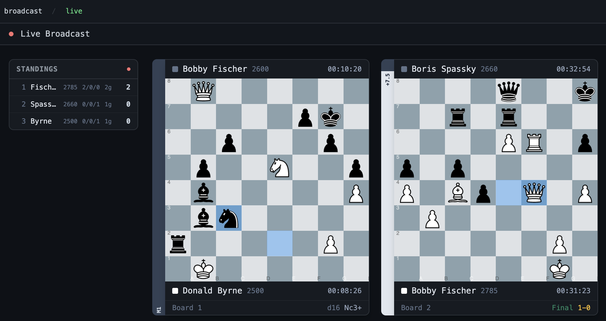

# Broadcasts 
### By the Chess Centre

## Integrated DGT Board Presentation

This is a work in-progress project to provide a fully integrated experience with **The Chess Centre** platform live events, bringing together player data, DGT broadcast data and event result details.




### Getting started

This project has two key components:

1. UI - React Application for displaying the Chess data

```$ npm start```

1. Backend - Node server to monitor pgn file changes produced by the `DGT LiveChess` application

```$ npm run server```


### DGT data stream

The initial intention _was_ to use the LiveChess WebSocket API to listen for moves and directly stream these to a `Chessboard` component using the `chess.js` methods `.fen()` or `.load_pgn()`. This, then abstracted into a clean React custom hook, something like:

```
const { moves, clockTimes, playerInfo } = useDGT();
```

This would be an ideal API for building a UI component, connecting the data to the presentation layer.

Unfortunately, this is far from easy to achieve. After reading the documentation and connecting to the `feed` socket subscription the responses are not aligned to the needs of this component*. As such a rudimental file reader solution has been used, this includes a configurable interval to `fetch` (poll) for pgn updates 🤢 (see `server.js`)

_* the data does appear to be there but the instantiation call to retreive the correct data is not documented_

### Next Steps

The most logical next steps here include:

1. Adding a Server Side websocket connection for pushing file change updates to the client
2. Adding the Client Side websocket connection for specific game changes (one or multiple websocket connections?)
3. Adding move square indication to the `lastMove` of the game (again, not easy to do from initial investigation)
4. Document approach and make reusable for other consumers, detatching the `<Results .../>` from the `<Viewer .../>`


