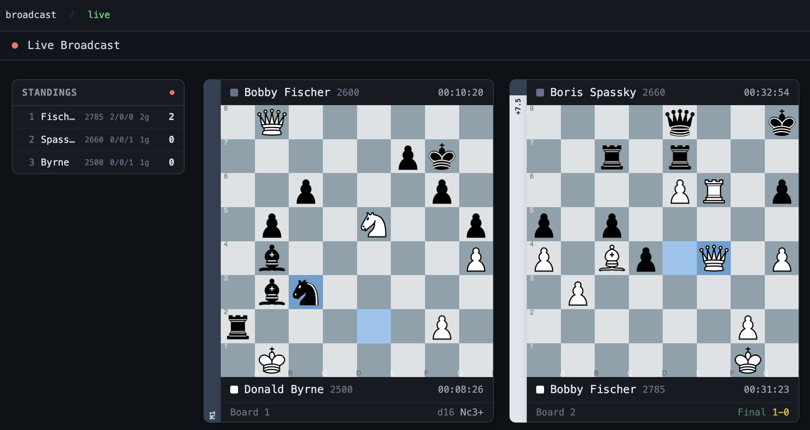
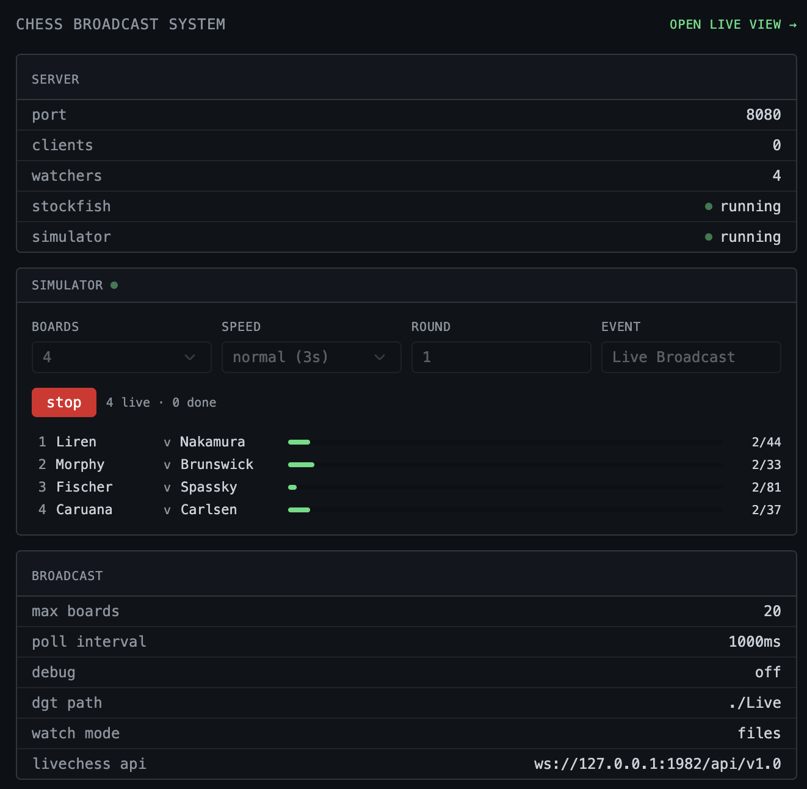

# Chess Broadcast System

Real-time DGT board integration for streaming live chess games.



<!-- screenshot: landing page dashboard -->


---

## Quick Start

```bash
npm install
cp .env.example .env
```

### Development (no DGT boards needed)

```bash
# Start everything (server + simulator + app)
npm run dev

# Open http://localhost:3000
```

The landing page is a system dashboard — configure the simulator, hit **start**, then click **open live view** to watch.

### Production (real DGT boards)

```bash
# Terminal 1: Start the server
npm run server

# Terminal 2: Start the app
npm start
```

Set `DGT_BASE_PATH` in `.env` to your DGT LiveChess PGN output directory.

---

## Dashboard

The landing page (`/`) is a terminal-style control panel with three sections:

**Server** — connection status, port, connected WebSocket clients, active file watchers, Stockfish engine status, simulator state.

**Simulator** — configure and run simulated games for testing:

- Boards (1–20)
- Speed (fast 1s / normal 3s / slow 6s)
- Round number
- Event name
- Live game progress with per-board status

**Broadcast** — read-only display of server configuration: max boards, poll interval, debug mode, DGT base path, watch mode, LiveChess API URL.

All values are fetched live from the server and polled every 3 seconds.

---

## Routes

| Route   | Description                                       |
| ------- | ------------------------------------------------- |
| `/`     | System dashboard and simulator controls           |
| `/live` | Live broadcast viewer with boards and leaderboard |

---

## Configuration

### Environment Variables (`.env`)

```bash
# Server
PORT=8080
CORS_ORIGIN=*

# DGT LiveChess
DGT_BASE_PATH=C:/Users/user/Desktop/Live
DGT_API_URL=ws://127.0.0.1:1982/api/v1.0
DGT_WATCH_MODE=files        # 'files' or 'api'

# Broadcast
MAX_BOARDS=20
POLL_INTERVAL=1000
DEBUG=false
```

### Client

Set `REACT_APP_SERVER_URL` in `.env` if the server is not on `http://localhost:8080`.

---

## REST API

| Method | Endpoint                | Description                                              |
| ------ | ----------------------- | -------------------------------------------------------- |
| `GET`  | `/api/config`           | Server configuration (DGT, broadcast settings)           |
| `GET`  | `/api/status`           | Runtime status (clients, watchers, stockfish, simulator) |
| `POST` | `/api/simulator/start`  | Start simulator `{ boards, speed, round, eventName }`    |
| `POST` | `/api/simulator/stop`   | Stop simulator                                           |
| `GET`  | `/api/simulator/status` | Simulator game progress                                  |
| `GET`  | `/:round/:board`        | Fetch specific game PGN                                  |

## WebSocket API

Connect to `ws://localhost:8080/games` for real-time game updates.

### Client to Server

```json
{ "type": "subscribe_round", "round": 1 }
{ "type": "ping" }
```

### Server to Client

```json
{ "type": "game_update", "round": 1, "board": 3, "data": { ... } }
{ "type": "eval_update", "board": 3, "evaluation": { ... }, "fen": "..." }
{ "type": "connected", "message": "Connected to chess broadcast server" }
```

---

## Architecture

```
server/
  server.js          Express + WebSocket server, file watching, Stockfish eval
  config.js          Environment-based configuration
  simulator.js       Game simulator using famous games collection
  pgn-generator.js   PGN file writer
  parse-game.js      PGN parser (players, clocks, moves, status)
  stockfish-service.js  Stockfish engine integration
  famous-games.js    Source games for simulation
  mock-data.js       Player names, ratings, time controls

src/
  pages/
    Home.js            System dashboard
    LiveBroadcast.js   Live broadcast viewer
  components/
    SimulatorPanel.js  Config dashboard (server, simulator, broadcast)
    Layout.js          Minimal terminal-style header
    Board/Board.js     Chessground board with eval bar
    Board/EvalBar.js   Position evaluation display
    Viewer/Game.js     PGN parser and board controller
    Shared/
      LiveLeaderboard.js  Auto-calculated standings
  hooks/
    usePgn.js          WebSocket connection and game state
    useDGT.js          Direct DGT WebSocket API (experimental)
    useInterval.js     Polling helper
```

### Data Flow

```
Simulator / DGT LiveChess
  → writes PGN files to Live/round-N/game-N.pgn
    → Chokidar file watcher detects changes
      → Server broadcasts via WebSocket
        → React app updates boards in real-time
          → Stockfish evaluates positions → eval updates
```

---

## DGT LiveChess Setup

1. Install [DGT LiveChess](https://www.livechess.com/) 2.2+
2. Settings > File Output > Enable PGN saving
3. Set output directory to match `DGT_BASE_PATH`
4. Directory structure: `round-1/game-1.pgn`, `round-1/game-2.pgn`, etc.
5. Connect boards via USB, assign board numbers, enter player info

### Expected Directory Structure

```
Live/
├── round-1/
│   ├── game-1.pgn
│   ├── game-2.pgn
│   └── game-3.pgn
└── round-2/
    ├── game-1.pgn
    └── game-2.pgn
```

---

## Troubleshooting

**No games appearing** — Check `DGT_BASE_PATH` matches your PGN directory. Verify folder structure is `round-N/game-N.pgn`. Enable `DEBUG=true` for file watcher logs.

**WebSocket not connecting** — Verify server is running on correct port. Check browser console. Ensure firewall allows WebSocket connections.

**Clocks not updating** — DGT LiveChess must include `[%clk H:MM:SS]` comments in PGN output. Enable clock output in DGT settings.

**Boards not auto-detecting** — Files must match pattern `game-N.pgn`. Enable `DEBUG=true` to see detection logs.

---

## Scripts

```bash
npm start              # React dev server
npm run server         # Express server with nodemon
npm run dev            # Server + simulator + app (all-in-one)
npm run simulate       # Interactive simulator
npm run simulate:quick # Quick start with 4 boards
npm run build          # Production build
npm run test:server    # Run server unit tests
```

---

## Credits

- [DGT](https://www.livechess.com/) — LiveChess software and hardware
- [chess.js](https://github.com/jhlywa/chess.js) — game logic
- [chessground](https://github.com/lichess-org/chessground) — board rendering
- [The Chess Centre](https://github.com/chess-centre) — original concept
